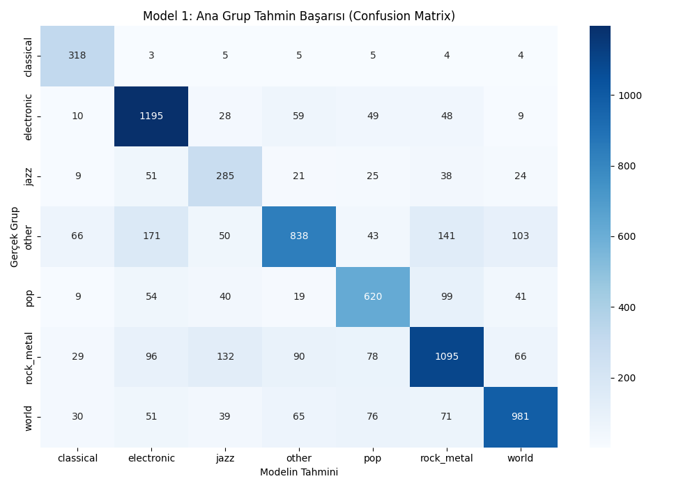

#  Yapay Zeka ile Müzik Türü Analizi ve Akıllı Öneri Platformu

Bu proje, Spotify API verilerini kullanarak müzik eserlerinin akustik altyapı karakterini ve metinsel özniteliklerini hiyerarşik (çift aşamalı) makine öğrenmesi modelleriyle sınıflandıran, son kullanıcıya popülerlik puanına göre dinamik içerik tavsiyesi sunan hibrit bir yapay zeka platformudur.

##  Proje Mimarisi & Özellikleri
- **Model 1 (Ana Gruplar):** `LinearSVC` ve `LogisticRegression` algoritmalarının oylama kombinasyonuna (**Voting Ensemble**) dayanır. Genel doğruluk oranı **%72.17**'dur.
- **Model 2 (Alt Türler):** Ki-Kare (`Chi2`) tabanlı `SelectKBest` özellik seçimiyle alt kırılımları sınıflandırır.
- **Optimizasyon:** 114k verilik ana kütleden, donanım bağımsız kararlı çalışma ve aşırı öğrenmeyi (overfitting) engelleme amacıyla dengeli 50.000 satırlık örneklem kullanılmıştır.
- **Güvenli Mimarili Arayüz:** Streamlit tabanlı dinamik Spotify Dashboard tasarımı. Giriş aşamasında akıllı arama kutularıyla otomatik veri doğrulaması yapar ve çıkış aşamasında Pandas/SQL canlı filtreleme fırlatarak gerçek zamanlı şarkı önerisi sunar.

## 📊 Model Başarı Matrisi
Projenin eğitimi sonucunda elde edilen ana grup tahmin başarısı (Confusion Matrix) aşağıdaki gibidir:


## 🛠️ Kurulum ve Çalıştırma

### 1. Veri Setinin Edinilmesi (Dataset)
Projenin boyut sınırları ve veri bütünlüğü gereği, 114.000 satırlık orijinal Spotify veri seti GitHub üzerinde barındırılmamaktadır. Projeyi çalıştırmak için öncelikle aşağıdaki adımları takip ederek veri setini indirmelisiniz:

- **Veri Seti Kaynağı:** Projede kullanılan resmi veri setine Kaggle üzerinden erişebilirsiniz: [Kaggle Spotify Dataset](https://www.kaggle.com/datasets/maharshipandya/-spotify-tracks-dataset)
- **Kurulum:** İndirdiğiniz `dataset.csv` (veya `maharshifichadia/spotify-dataset`) dosyasını proje ana dizininde **`data/`** adında bir klasör oluşturarak içerisine **`dataset.csv`** ismiyle yerleştiriniz.
- *Not: `main.py` kodu çalıştırıldığında, `data/dataset.csv` konumu otomatik olarak kontrol edilmekte ve dosya eksikse internet üzerinden indirme mekanizması tetiklenmektedir.*

### 2. Kütüphanelerin Yüklenmesi
Gerekli olan tüm kütüphaneler (`streamlit`, `scikit-learn`, `pandas`, `numpy` vb.) proje başlatıldığında otomatik olarak denetlenir ve eksik olanlar sistem tarafından kendiliğinden yüklenir.

### 3. Modeli Eğitmek ve Ağırlıkları Kaydetmek
Sıfırdan model eğitimi gerçekleştirmek, öznitelik haritalarını çıkarmak ve `.pkl` uzantılı model beyinlerini üretmek için terminale şu komutu yazın:
```bash
python main.py
